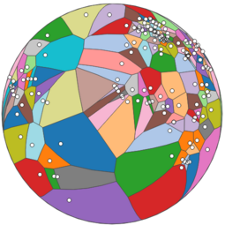
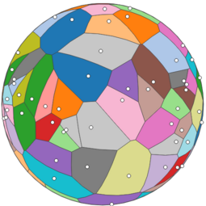
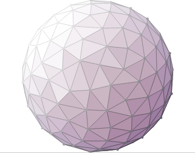
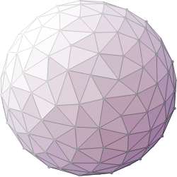
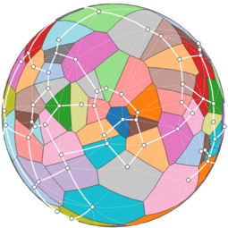
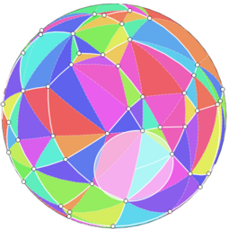
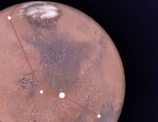
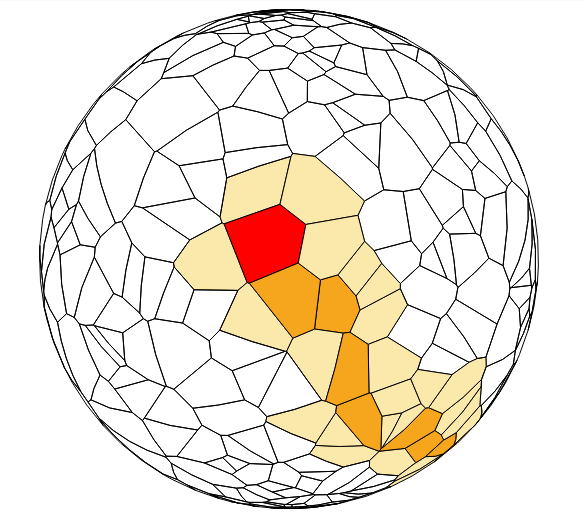
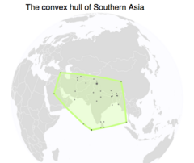
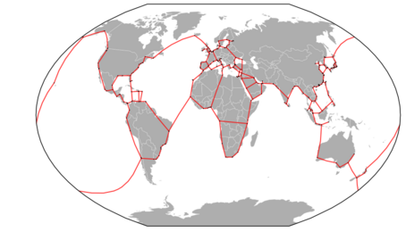

# d3-geo-voronoi

This module adapts [d3-delaunay](https://github.com/d3/d3-delaunay) for spherical data. Given a set of objects in spherical coordinates, it computes their Delaunay triangulation and its dual, the Voronoi diagram.

In addition, it offers convenience methods to extract the convex hull, the Urquhart graph, the circumcenters of the Delaunay triangles, and to find the cell that contains any given point on the sphere.

The module offers two APIs.

The GeoJSON API is the most convenient for drawing the results on a map. It follows as closely as possible the API of the [d3-voronoi](https://github.com/d3/d3-voronoi/) module. It is available with *d3.geoVoronoi()*.

A lighter API is available with *d3.geoDelaunay()*. It offers the same contents, but with a different presentation, where every vertex, edge, polygon… is referenced by an id rather than by its coordinates. This allows a more compact representation in memory and eases topology computations.


## Installing

If you use npm, `npm install d3-geo-voronoi`. You can also download the [latest release on GitHub](https://github.com/d3/d3-geo-voronoi/releases/latest). For vanilla HTML in modern browsers, import d3-geo-voronoi from Skypack:

```html
<script type="module">
import {geoDelaunay} from "https://cdn.skypack.dev/d3-geo-voronoi@2";
</script>
```

For legacy environments, you can load d3-geo-voronoi’s UMD bundle from an npm-based CDN such as jsDelivr; a `d3` global is exported:

```html
<script src="https://cdn.jsdelivr.net/npm/d3-geo-voronoi@2"></script>
<script>
d3.geoContour();
</script>
```

## API Reference

* [Delaunay](#delaunay)
* [Voronoi](#voronoi)
* [Contours](#contours)


### Delaunay

This API is a similar to [d3-delaunay](https://github.com/d3/d3-delaunay)’s API. It provides information on the Delaunay triangulation (edges, triangles, neighbors, Voronoi cells, etc) as indices in two arrays — the array of points, and the array of circumcenters. It facilitates topological computations. To draw the actual triangles, Voronoi cells etc, the [Voronoi](#Voronoi) API described in the next section will often be easier to use.

<a href="#geo-delaunay" name="geo-delaunay">#</a> d3.<b>geoDelaunay</b>([data])
 · [Source](https://github.com/Fil/d3-geo-voronoi/blob/main/src/delaunay.js)

Creates a new *spherical* Delaunay layout. _data_ must be passed as an array of [lon, lat] coordinates.


<a href="#geo_delaunay_find" name="geo_delaunay_find">#</a> <i>delaunay</i>.<b>find</b>(*lon*, *lat*[, *node*])

Returns the closest point to [lon, lat]; optionally starting the search at *node* to boost the performance.

<a href="#geo_delaunay_urquhart" name="geo_delaunay_urquhart">#</a> <i>delaunay</i>.<b>urquhart</b>([*distances*])

Given a vector of distances (in the same order as the <a href="#geo_delaunay_edges">edges</a> list), returns a vector of boolean values: true if the edge belongs to the Urquhart graph, false otherwise.

[](https://observablehq.com/@fil/world-cities-urquhart)


<a href="#geo_delaunay_hull" name="geo_delaunay_hull">#</a> <i>delaunay</i>.<b>hull</b>()

Returns an array of indices of points on the hull. The array is empty if the points cover more than a hemisphere.

<a href="#geo_delaunay_edges" name="geo_delaunay_edges">#</a> <i>delaunay</i>.<b>edges</b>

An array of edges as indices of points [from, to].

[](https://observablehq.com/@manzt/world-airports-voronoi-in-vega-lite)


<a href="#geo_delaunay_triangles" name="geo_delaunay_triangles">#</a> <i>delaunay</i>.<b>triangles</b>

An array of the triangles, as indices of points [a, b, c]. The triangles are orientated in a clockwise manner, triangles that span more than the hemisphere are removed.


<a href="#geo_delaunay_centers" name="geo_delaunay_centers">#</a> <i>delaunay</i>.<b>centers</b>

The array of centers in spherical coordinates; the first *t* centers are the *t* triangles’s circumcenters. More centers might be listed in order to build the Voronoi diagram for smaller number of points (n≤3).

<a href="#geo_delaunay_neighbors" name="geo_delaunay_neighbors">#</a> <i>delaunay</i>.<b>neighbors</b>

The array of neighbors indices for each vertex.

[](https://observablehq.com/@mbostock/spherical-voronoi-coloring)


<a href="#geo_delaunay_polygons" name="geo_delaunay_polygons">#</a> <i>delaunay</i>.<b>polygons</b>

Array of Voronoi cells for each vertex. Each cell is an array of centers ordered in a clockwise manner.

<a href="#geo_delaunay_mesh" name="geo_delaunay_mesh">#</a> <i>delaunay</i>.<b>mesh</b>

An array containing all the edges of the Voronoi polygons.


### Voronoi

This API is a wrapper around the <a href="#Delaunay">Delaunay</a> API, with inputs and outputs in GeoJSON, ready to draw on a map.

<a href="#geo-voronoi" name="geo-voronoi">#</a> d3.<b>geoVoronoi</b>([data])
 · [Source](https://github.com/Fil/d3-geo-voronoi/blob/main/src/voronoi.js), [Examples](https://bl.ocks.org/Fil/74295d9ffe097ae4e3c93d7d00377d45)

Creates a new *spherical* Voronoi layout. _data_ can be passed as an array of [lon, lat] coordinates, an array of GeoJSON features, or a GeoJSON FeatureCollection.

The following methods are similar to [d3-voronoi](https://github.com/d3/d3-voronoi/)'s methods:

<a href="#geo_voronoi_delaunay" name="geo_voronoi_delaunay">#</a> <i>voronoi</i>.<b>delaunay</b>

The geoDelaunay object used to compute this diagram. 

<a href="#geo_voronoi_x" name="geo_voronoi_x">#</a> <i>voronoi</i>.<b>x</b>([<i>x</i>])

Sets or returns the _x_ accessor. The default _x_ and _y_ accessors are smart enough to recognize GeoJSON objects and return the geoCentroid of each feature.

<a href="#geo_voronoi_y" name="geo_voronoi_y">#</a> <i>voronoi</i>.<b>y</b>([<i>y</i>])

Sets or returns the _y_ accessor.

[](https://bl.ocks.org/Fil/74295d9ffe097ae4e3c93d7d00377d45)

<a href="#geo_voronoi_polygons" name="geo_voronoi_polygons">#</a> <i>voronoi</i>.<b>polygons</b>(<i>[data]</i>) · [Source](https://github.com/Fil/d3-geo-voronoi/blob/main/src/voronoi.js), [Examples](https://bl.ocks.org/Fil/a9ba8d0d023752aa580bd95480b7de60)


Returns the Voronoi tessellation of the data as a GeoJSON collection of polygons. (If there is only one data point, returns the Sphere). Each polygon exposes its datum in its properties.

[](https://bl.ocks.org/Fil/a9ba8d0d023752aa580bd95480b7de60)

<a href="#geo_voronoi_cellMesh" name="geo_voronoi_cellMesh">#</a> <i>voronoi</i>.<b>cellMesh</b>(<i>[data]</i>) · [Source](https://github.com/Fil/d3-geo-voronoi/blob/main/src/voronoi.js)

Returns the Voronoi tessellation as a GeoJSON mesh (MultiLineString).

<a href="#geo_voronoi_triangles" name="geo_voronoi_triangles">#</a> <i>voronoi</i>.<b>triangles</b>(<i>[data]</i>) · [Source](https://github.com/Fil/d3-geo-voronoi/blob/main/src/voronoi.js), [Examples](https://bl.ocks.org/Fil/b1ef96e4bc991eb274f8d3a0a08932f9)

Returns the Voronoi tessellation of the data as a GeoJSON collection of polygons. Each triangle exposes in its properties the three sites, its spherical area (in steradians), and its circumcenter.


[](https://bl.ocks.org/Fil/b1ef96e4bc991eb274f8d3a0a08932f9)

[](https://bl.ocks.org/Fil/955da86d6a935b26d3599ca5e344fb38)

<a href="#geo_voronoi_mesh" name="geo_voronoi_mesh">#</a> <i>voronoi</i>.<b>mesh</b>(<i>[data]</i>) · [Source](https://github.com/Fil/d3-geo-voronoi/blob/main/src/voronoi.js), [Examples](https://bl.ocks.org/Fil/fbaf391e1ae252461741ccf401af5a10)

Returns the Delaunay edges [as a GeoJSON mesh](https://bl.ocks.org/Fil/fbaf391e1ae252461741ccf401af5a10) (MultiLineString).


<a href="#geo_voronoi_links" name="geo_voronoi_links">#</a> <i>voronoi</i>.<b>links</b>(<i>[data]</i>) · [Source](https://github.com/Fil/d3-geo-voronoi/blob/main/src/voronoi.js), [Examples](https://bl.ocks.org/Fil/1a78acf8b9b40fe8ecbae7b5035acf2b)

Returns the Delaunay links of the data as a GeoJSON collection of lines. Each line exposes its source and target in its properties, but also its length (in radians), and a boolean flag for links that belong to the [Urquhart graph](https://en.wikipedia.org/wiki/Urquhart_graph).

[](https://bl.ocks.org/Fil/1a78acf8b9b40fe8ecbae7b5035acf2b)


[](https://bl.ocks.org/Fil/79b9f17979c4070dee3cbba1c5283502)


[](https://bl.ocks.org/Fil/1c2f954201523af16280db018ddd90cc)


<i>voronoi</i>.<b>extent</b>(<i>[extent]</i>) and <i>voronoi</i>.<b>size</b>(<i>[size]</i>) are not implemented.

Indeed, defining the “paper extent” of the geoVoronoi polygons can be quite tricky, [as this block demonstrates](https://bl.ocks.org/Fil/6128aae082c04eef06422f953d0f593f).


<a name="geo_voronoi_find" href="#geo_voronoi_find">#</a> <i>voronoi</i>.<b>find</b>(<i>x,y,[angle]</i>) · [Source](https://github.com/Fil/d3-geo-voronoi/blob/main/src/voronoi.js), [Examples](https://bl.ocks.org/Fil/e94fc45f5ed4dbcc989be1e52b797fdd)

Finds the closest site to point *x,y*, i.e. the Voronoi polygon that contains it. Optionally, return null if the distance between the point and the site is larger than *angle* degrees.

[](https://bl.ocks.org/Fil/e94fc45f5ed4dbcc989be1e52b797fdd)


<a name="geo_voronoi_hull" href="#geo_voronoi_hull">#</a> <i>voronoi</i>.<b>hull</b>(<i>data</i>) · [Source](https://github.com/Fil/d3-geo-voronoi/blob/main/src/voronoi.js), [Examples](https://bl.ocks.org/Fil/6a1ed09f6e5648a5451cb130f2b13d20)

Returns the spherical convex hull of the *data* array, as a GeoJSON polygon. Returns null if the dataset spans more than a hemisphere. Equivalent to:

```js
voronoi(data).hull();
```

[](https://bl.ocks.org/Fil/6a1ed09f6e5648a5451cb130f2b13d20)


### Contours

Create *spherical* contours for non-gridded data.

The API of geoContour is similar to that of [d3-contour](https://github.com/d3/d3-contour) and [d3-tricontour](https://github.com/Fil/d3-tricontour):

<a href="#geocontour" name="geocontour">#</a> d3.<b>geoContour</b>()
 · [Source](https://github.com/Fil/d3-geo-voronoi/blob/main/src/contour.js), [Examples](https://observablehq.com/@fil/spherical-contours)

Constructs a new geocontour generator with the default settings.

[](https://observablehq.com/@fil/spherical-contours)


<a href="#_geocontour" name="_geocontour">#</a> _geocontour_(_data_) · [Examples](https://observablehq.com/@fil/spherical-contours)

Returns an array of contours, one for each threshold. The contours are MultiPolygons in GeoJSON format, that contain all the points with a value larger than the threshold. The value is indicated as _geometry_.value.

The _data_ is passed as an array of points, by default with the format [lon, lat, value].

<a href="#contour" name="contour">#</a> _geocontour_.<b>contour</b>(_data_[, _threshold_])

Returns a contour, as a MultiPolygon in GeoJSON format, containing all points with a value larger or equal to _threshold_. The threshold is indicated as _geometry_.value 

<a href="#contours" name="contours">#</a> _geocontour_.<b>contours</b>(_data_)

Returns an iterable over the contours.

[](https://observablehq.com/@fil/spherical-contours-iterator)


<a href="#isobands" name="isobands">#</a> _geocontour_.<b>isobands</b>(_data_)

Returns an iterable over the isobands: contours between pairs of consecutive threshold values _v0_ (inclusive) and _v1_ (exclusive). _geometry_.value is equal to _v0_, _geometry_.valueMax to _v1_.

[](https://observablehq.com/@fil/spherical-isobands)

<a href="#x" name="x">#</a> _geocontour_.<b>x</b>([_x_])

Sets the *x* (longitude) accessor. Defaults to \`d => d[0]\`. If _x_ is not given, returns the current x accessor.

<a href="#y" name="y">#</a> _geocontour_.<b>y</b>([_y_])

Sets the *y* (latitude) accessor. Defaults to \`d => d[1]\`. If _y_ is not given, returns the current y accessor.

<a href="#value" name="value">#</a> _geocontour_.<b>value</b>([_value_])

Sets the *value* accessor. Defaults to \`d => d[2]\`. Values must be defined and finite. If _value_ is not given, returns the current value accessor.

[](https://observablehq.com/@fil/blurry-contours)

[](https://observablehq.com/@fil/h3-hexagons-geocontours)


<a href="#thresholds" name="thresholds">#</a>  _geocontour_.<b>thresholds</b>([_thresholds_])

Sets the thresholds, either explicitly as an array of values, or as a count that will be passed to d3.ticks. If empty, returns the current thresholds.


_Note:_ d3.geoContour uses the experimental API of d3-tricontour: [triangulate](https://github.com/Fil/d3-tricontour/blob/main/README.md#triangulate), [pointInterpolate](https://github.com/Fil/d3-tricontour/blob/main/README.md#pointInterpolate) and [ringsort](https://github.com/Fil/d3-tricontour/blob/main/README.md#ringsort).


### Other tools & projections

There is no reason to limit the display of Voronoi cells to the orthographic projection. The example below displays the Urquhart graph of top container ports on a Winkel tripel map.

[](https://bl.ocks.org/Fil/24d5ee71f09ba72893323d803242c38a)

[Geo_triangulate](https://jessihamel.github.io/geo_triangulate/) converts GeoJSON to triangles for 3d rendering.


### Comparison with planar Voronoi Diagrams

- the Delaunay/Voronoi topology is quite different on the sphere and on the plane. This module deals with these differences by first projecting the points with a stereographic projection, then stitching the geometries that are near the singularity of the projection (the “infinite horizon” on the plane is one point on the sphere).

- geoVoronoi returns GeoJSON objects, which are often `FeatureCollections`. By consequence, you will have to change `.data(voronoi.polygons())` to `.data(geovoronoi.polygons().features)`, and so on.

- geoVoronoi is built on [d3-delaunay](https://github.com/d3/d3-delaunay), which is also exposed as d3.geoDelaunay in this library. If you want to have the fastest results, you should try to use d3.geoDelaunay directly (see the examples).

- geoVoronoi and geoDelaunay offer methods to compute the spherical [convex hull](#geo_voronoi_hull) and the [Urquhart graph](#geo_voronoi_links) of the data set. These can be achieved with the planar Voronoi ([hull](https://bl.ocks.org/mbostock/6f14f7b7f267a85f7cdc), [Urquhart](https://bl.ocks.org/Fil/df20827f817abd161c768fa18dcafcf5)), but are not part of d3-voronoi or d3-delaunay.


